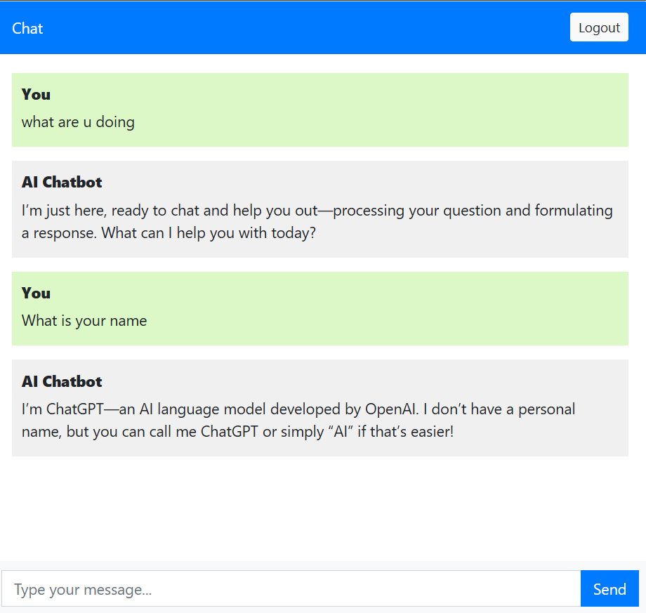

# Chatbot Django Project

A simple chatbot application built with Django and integrated AI interaction logic.


## Demo Screenshot




## Features

- User authentication (login/register)
- Chat interface with AI-powered responses
- Stores chat history in the database
- Secret keys handled securely (make sure to use environment variables!)

## Getting Started

### Prerequisites

- Python 3.8+
- Django 3.x or 4.x
- pip (Python package manager)

### Installation

1. Clone the repository:

```bash
git clone https://github.com/kanishka-rani-2005/Chatbot.git
cd Chatbot

```

2. Create and activate a virtual environment:
   ```bash
    python -m venv venv
     # On Windows
    venv\Scripts\activate
   # On macOS/Linux
    source venv/bin/activate
    ```
3. Install dependencies:
   ```bash
   pip install django
   pip install langchain
   pip insall dotenv-python
   pip install langchain-groq
   pip install langchain_community
   ```
   
4. Set environment variables for your API keys :
   ```bash
   GROQ_API_KEY=your_api_key_here
   ```

5. Run migrations
   ```bash
      python manage.py migrate
   ```
6. Start the development server:
   ```bash
       python manage.py runserver
    ```
7. #### Open your browser and go to http://127.0.0.1:8000


## Project Structure

- chatbotapp/ — Main Django app with views, models, templates

- templates/ — HTML templates for chat, login, register, base

- manage.py — Django project management script

# Contributing

Feel free to open issues or submit pull requests!

# License

This project is licensed under the MIT License.
